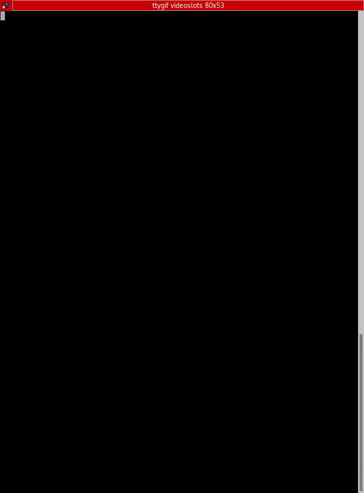

# VideoSlots CLI

[](https://semaphoreci.com/aasanchez/virtual-slot-machine)
[](https://scrutinizer-ci.com/g/aasanchez/virtual-slot-machine/?branch=master)
[](https://github.styleci.io/repos/147697837)

## The slot command
* Assume that every bet as the value of 1 Euro
* Generate a random board with 5 columns and 3 rows using 10 different symbols (9, 10, J, Q,
K, A, cat, dog, monkey and bird).
*) Use the following logic for numbering each symbol on the board:

|     |     |     |     |     |
|:---:|:---:|:---:|:---:|:---:|
|  0  |  3  |  6  |  9  |  12 |
|  1  |  4  |  7  |  10 |  13 |
|  2  |  5  |  8  |  11 |  14 |


Example: `[J, J, J, Q, K, cat, J, Q, monkey, bird, bird, bird, J, Q, A]`

These 15 random symbols generate this:

|     |     |     |     |     |
|:---:|:---:|:---:|:---:|:---:|
|  J  |  J  |  J  |  Q  |  K  |
| CAT |  J  |  Q  | MON | BIR |
| BIR | BIR |  J  |  Q  |  A  |


* A pay out happens when 3 or more consecutive symbols of the same kind are present in a
payline, always starting from the first column (0,1,2). For the test consider the following
paylines:

  * `0 3 6 9 12`
  * `1 4 7 10 13`
  * `2 5 8 11 14`
  * `0 4 8 10 12`
  * `2 4 6 10 14`

From the example above 2 paylines are matched `J J J` from `0 3 6 9 12` and `0 4 8 10 12`.

* Pay out return to the player the following amount:
  * 3 symbols: 20% of the bet.
  * 4 symbols: 200% of the bet.
  * 5 symbols: 1000% of the bet.
* Print from the console command the following:
  * board: [0,….,14]
  * paylines: Array with matched payline and number of matched symbol.
  * bet_amount: monetary numbers in cents 1€ = 100cents. In you case is always 100
  * total_win: amount won.
Considering the above example the result will be:

```javascript
{
board: [J, J, J, Q, K, cat, J, Q, monkey, bird, bird, bird, J, Q, A],
paylines: [{"0 3 6 9 12": 3}, {"0 4 8 10 12":3}],
bet_amount: 100,
total_win: 40
}
```

There is no need for a database or session state, that would end up in a version 2 outside the
scope of this test.

## HOW TO USE

### In local

Using the local resources



### Docker

####  Install dependencies

We need to run composer install to pull in all of the libraries that make up Lumen — we can use the composer/composer image from the docker hub to handle this for us.

We’ll create a throw-away container by executing the following command.

``` $ docker run --rm -v $(pwd):/app composer/composer install ```

#### Starting the services

``` docker-compose up ```

#### Using our new command

``` docker-compose exec app php artisan videoslots ``` 